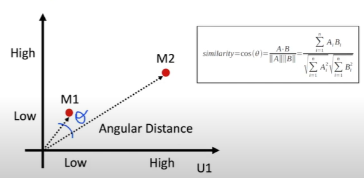

# Recommender implementation in Python

Two types of recommender systems are commonly used for movie recommentadation:

- Content based : Director, actor, genre of a movie
- Collaborative filtering : User ratings from other users.

User ratings are converted to vectors which can be used to measure distances. Angular distances provide better measure compared to euclidean distance and so  cosine similarity is used. Pearson correlation is a modified version of cosine distance but reduces mean.  

