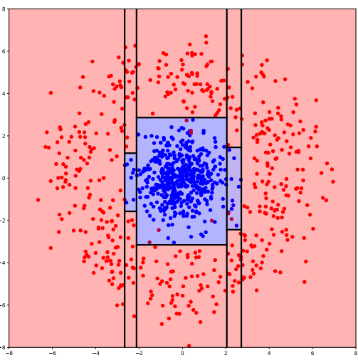
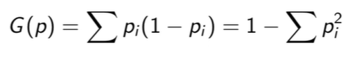
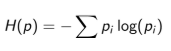

# Regression forest implementation from scratch in Python

Regression forest is supervised learning algorithm which can be used for regression too.

Random forest algorithm were winning before deep learning came along and it is still good for certain problems. Random forests are much faster than deep learning algorithms.

Regression forests uses Decision Trees which do recursive splitting thus enabling splitting of real world data which is not axis-aligned. An example shown in figure below (using information gain):

 

## Decision trees  

 Decision tree consists of nodes and leaves. The node is the feature value to do the split and the leaves are the class value to output. A training data that only contains one class will only have one leaf node. In all other cases tree construction will be recursive. Consider every single feature and every single split of each feature and select the split the minimizes the total loss for the loss function. Send that down and build two trees out of the two splits and keep going.

 Commonly used loss functions are 
 - Gini impurity : Probability that if you select two items from a dataset at random (with replacement), they will have a different class. Uses probability , so values partial success. Splits need to be weighted.
    
 where pi is probability of selecting class i from the dataset.
 - Information gain : Also known as entropy, measures how much is learned from traversing a split. In general entropy denotes the number of bits required to encode the data with a given probability distribution. In case of a decision tree it is the number of bits obtained from traversing a split.  
 

 Information gain works for regression since IG works for anything that is a probability distribution. Gini is only defined for discrete type of variables.

 Overfitting: fitting the noise in the training set, which doesnt exist in the test set or real world. In decision trees overfitting problem is resolved by stopping early. Instead of going the tree all the way down so that we get perfect purity of the classes, we only go down to a limit (have upper limit on tree depth or have a minimum limit on leaf node size i.e don't consider a leaf node that doesn't have a minimum number of 10 data points for instance) then choose the class that is majority in the node. In addtion to tree depth and minimum limit on leaf node size choice between gini impurity and information gain can be made a hyperpameter too.

 If classification uses majority of a class to reach a leaf. for regression minimizing variance is what is commonly used. A split that minimizes the variance is always chosen. At the leaves mean is used.

 To handle missing data there are two approaches.
 - For rare missing data when we hit a node containing missing data, we go down both the branches.
 - For common (large number) missing data we sample. Conceptually we toss a coin and decide which branch to go down. But the coin is weighted i,e probability of going down a branch is proportional to the amount of data down that branch, so we need to record how many data points went left and how many data points went right during training.  

 ## Random Forests

 Random forests = Decision trees + ensemble learning.
 Ensemble learning = Multiple estimators (Decision trees for eg)

 Random forests uses randomized training also known as bagging. (Bootstrap + Aggregating + random subspace method.)
 Bootstrapping is to create  new dataset by drawing with replacement.
 Random subspace is bootstrapping applied to features,and features are selected randomly at each split. sqrt of number of features is a good approach.  

 ## Test dataset

 Kaggle data: [House Prices: Advanced Regression Techniques](https://www.kaggle.com/c/house-prices-advanced-regression-techniques). It contains 1460 training data points and 80 features that might help us predict the selling price of a house.

 The data consists of both numerical and categorical data, so model was trained on the numerical data only. The categorical data needed more careful and detailed pre-processing. 

 ## Scores
r2 score: 0.965822807121343

