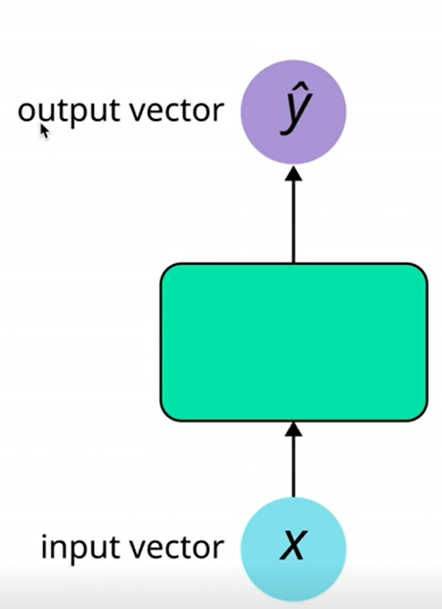

# Sentiment_Classification_with_RNN_&_LSTM's

Normal deep learning networks such as MLP and CNN have no sequences involved and map a fixed size input vector to a fixed output vector such as probability of output classes. These problems are called one to one problems and we use feed forward Neural Networks (NN's) to solve these problems. feed forward NN's assume all inputs and outputs are independent of each other.
 

 Applications which deal with sequences such as text (sequence of words or sequence of characters), time series such as audio, video or power signals or stock price use a different class of NN's called Recurrent Neural Networks.

