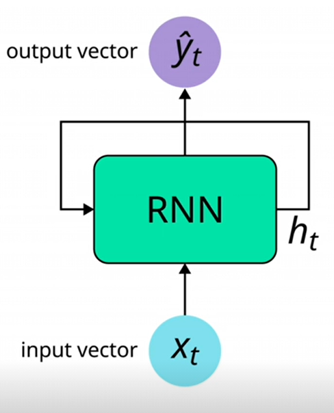
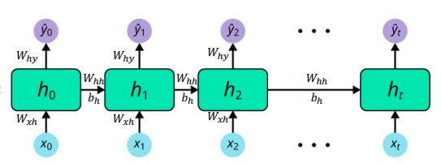

# Sentiment_Classification_with_RNN_&_LSTM's

Normal deep learning networks such as MLP and CNN have no sequences involved and map a fixed size input vector to a fixed output vector such as probability of output classes. These problems are called one to one problems and we use feed forward Neural Networks (NN's) to solve these problems. feed forward NN's assume all inputs and outputs are independent of each other.
 

 Applications which deal with sequences such as text (sequence of words or sequence of characters), time series such as audio, video or power signals or stock price use a different class of NN's called Recurrent Neural Networks. RNN's have an internal loopto perform same computation on every element of a sequence. This allows information from previous time to persist.

 

RNN's have an internal/hidden state that can represent context information. This considered as memory that captures information for not only current time step xt but also previous timesteps xt-1 all the way till x0. This preserves context information of the whole sequence.

 

As can be seen from the unrolled rnn, all weight metrices and biases are irrelevant with time-step t. It means ate every time step, parameters are shared. Same computation is carried out at each time step just with different inputs. This reduces total number of parameters needed to train the rnn. We may not need every input and outputs depending on the task.

RNN's are trained through a technique called Back Propagation Through Time. Computing the gradients involves multiplying multiple repeating factors. If the repeating factors are bigger than 1 it leads to exploding gradient problem and if the repeating factors are less than 1 it causes vanishing gradient problem. Exploding gradient problem can be easily dealt with through the use of gradient clipping, Vanishing gradient problem is commonly solved through change of architecture.

LSTM : Long short Term Memory Network. Designed to avoid long term dependency problems of RNN's. It has a mechanism called gates which controls what information to keep and what to forget. Cell states act as a transport highway tha runs through the entire chain with only minor interactions. It makes it easy for information to flow along the chain.

This project applies both RNN and LSTM for sentiment classification.

